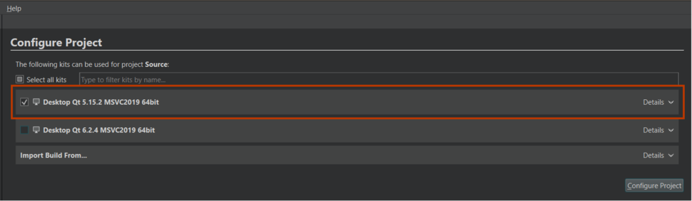

[](https://openept.net)
Easy-to-use, low-cost, open-source solution that includes compatible hardware and software sets of tools. This comprehensive solution is designed to fulfill the need for firmware energy profiling, as well as State of Charge (SoC) and State of Health (SoH) algorithm evaluation for real LiPo battery-powered embedded devices.

Official [youtube](https://www.youtube.com/playlist?list=PLTG-EoxvlLos_3Sex3R0yfDCwpDYyRSOo) channel 

---
# Content
- [Features](#features)
- [Building and Running the Energy Profiler Probe GUI](#building-and-running-the-energy-profiler-probe-gui)
- [Contributor guide](#contributor-guide)
- [Documentation](#documentation)
- [Acknowledgments](#acknowledgments)


---
# Features
- Real-time voltage and current streaming
- High-speed data acquisition up to 1 MSPS
- Configurable GUI for advanced control
- Open source hardware
  
---
# Building and Running the Energy Profiler Probe GUI

To successfully build and run the OpenEPT GUI application, **Qt** development environment must be installed and properly configured with the required dependencies. The following steps guide you through the full setup process.

## Step 1: Download and Install Qt and relevant packages

The Qt framework should be obtained from the official Qt website [this link](https://doc.qt.io/qt-6/get-and-install-qt.html).

Once the installer is downloaded and executed, users will be prompted to complete the sign-up process. Following successful registration, the installer will proceed to the component selection stage. For proper compilation and execution of the GUI application, the following components must be selected:


If Qt has been successfully installed, the application named **Qt Creator** should be launchable without issues. Upon starting Qt Creator, Welcome page will be displayed, which provides quick access to recent projects, examples, tutorials, and version control options. This interface should resemble what is shown in the Figure below.


## Step 2: Clone the Project from the Official GitHub Repository

There are two main methods for downloading the project from the official GitHub repository:

- **Method 1:** Using a Git console, such as **Git Bash**, to clone the repository directly via the command line.
- **Method 2:** Navigate to the repository's GitHub page, click the green **Code** button, and select **Download ZIP**. This will download the project files as a compressed archive.


## Step 3: Import the Project

1. Launch Qt Creator and On the left-hand sidebar, click on the **Welcome** tab.
2. Click on **Open Project** (1 and 2 on the figure bellow).


When the **Open Project** window opens, specify the directory where the project is located (in this case, `Source/OpenEPT.pro`).  
To do so, select the **OpenEPT.pro** and click Open (Figure bellow).


After project is successfully loaded for the first time, Qt Creator will automatically open the initial project configuration dialog to choose an appropriate build kit and associated settings. 
It is essential to select the kit labelled **Qt 5.12.2 MSVC 2019 64-bit**, once the correct kit is selected click on Configure Project to proceed (Figure bellow).



## Step 4: Build, Run, and Start the First Debug Session

Once the project is fully configured:

1. Selecting the desired build configuration (1 on the figure bellow). Choose between the Debug configuration - used during development for troubleshooting and includes additional debugging symbols, while the Release configuration - used for deployment. 
2. The next step is to compile the project (2 on the figure bellow). This is achieved by clicking the Build button (represented by a hammer icon) located in the lower-left corner of the Qt Creator interface, or by navigating through the top menu via Build > Build Project.
3. The application launch (3 on the figure bellow) when Debug configuration is selected, the application should be started by clicking the Run button that includes a small briefcase icon. For Release configuration, the standard Run button (green play icon) next to the configuration selector should be used, or alternatively via Build > Run from the menu. 


---
# Contributor guide

## Step 1:  Fork the Repository

To start contributing, fork the main repository to your own GitHub account:

1. Navigate to the repository you want to contribute to.
2. Click the **Fork** button in the upper-right corner. *(This is an example for `OpenEPT/FEPLib` repo.)*

3. This will create a copy of the repository under your GitHub account.

## Step 2: Clone the Forked Repository

Once the repository is forked, clone it to your local machine:

```bash
# Replace <your-username> with your GitHub username
git clone https://github.com/<your-username>/<repository-name>.git
cd <repository-name>
```

## Step 3: Create a New Branch

Before making changes, create a new branch based on the type of contribution:
- For new features, name the branch `feature/<name>`.
- For bug fixes, name the branch `bug/<name>`.

To create a branch:

```bash
# Replace <branch-name> with your branch name
# Example for a feature: feature/apard32690_lib
# Example for a bug fix: bug/fix_esp12e_lib
git checkout -b <branch-name>
```
## Step 4: Make your changes

Make the necessary changes to your branch. Test thoroughly to ensure your contribution does not introduce new issues.

Before any changes, please read developer [Documentation](#documentation)

## Step 5: Commit your changes

Once your changes are ready, stage and commit them:

```bash
git add .
# Write a descriptive commit message
git commit -m "Description of the changes made"
```
## Step 6: Push Your Changes to Your Fork

Push the changes to your forked repository:

```bash
# Push the branch to your fork
git push origin <branch-name>
```
## Step 7: Create a Pull Request
1. Navigate to your forked repository on GitHub.
2. Switch to the branch you just pushed.
3. Click the **Compare & pull request** button.

4. Ensure the base repository is set to the main/master repository and the base branch is `main
5. Provide a descriptive title and detailed description for your pull request.
6. Add appropriate reviewers
7. Submit the pull request.

## Step 8: Collaborate on the Review Process

Once the pull request is submitted:
1. Wait for project maintainers to review your changes.
2. Address any feedback provided by making additional commits to your branch.
3. Once approved, the maintainers will merge your changes.

## Step 9: Sync with the Main Repository

After your changes are merged, keep your fork updated with the main repository to avoid conflicts:
```bash
git remote add upstream https://github.com/<original-owner>/<repository-name>.git
git fetch upstream
git checkout main
git merge upstream/main
```
---
# Documentation

For detailed developer instructions and additional materials, please see the Documentation->Software under [Materials](https://www.openept.net/pages/materials) on the offical project website.

---
# Acknowledgments
[](https://nlnet.nl/)
